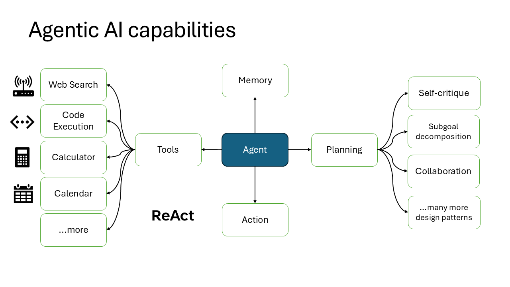

  <h2>Welcome to the Microsoft Autogen Workshop: A Beginner’s Guide to Agentic AI</h2>

This beginner-level, 8-hour workshop is designed for anyone curious about getting started with Agentic AI in the world of data. Whether you're a data engineer, analyst, or simply exploring how AI can support smarter decisions, this session will guide you through the basics. 

In the first part of the workshop, you'll dive into [Microsoft Autogen](https://microsoft.github.io/autogen/stable/index.html) to learn what Agentic AI is, how it can automate tasks, and how it enhances data workflows through multi-agent coordination. You'll get hands-on experience building intelligent systems using AutoGen before expanding into other tools like [Semantic Kernel](https://github.com/microsoft/semantic-kernel) and [Crew AI](https://www.crewai.com/) in part 2.

#### 💡 Workshop Demo Disclaimer

All demos in this workshop have been tested and validated for expected performance. However, since LLMs are probabilistic and non-deterministic by design, prompt outcomes may vary between runs, even with identical inputs. Minor refinements like rephrasing, formatting tweaks, or few-shot examples may be required to consistently guide the model toward the intended output.

You're absolutely encouraged to:

- 🛠 Experiment with the provided prompt templates  
- ✍️ Modify system instructions to suit your use case  
- 🚀 Optimize and adapt prompts throughout the workshop

The goal is to empower you to shape and refine agent workflows to best fit your needs. Flexibility and exploration are part of the learning process—so feel free to make it your own!

👋 Why don’t I introduce myself?
Hi! I'm <a href="https://datadrivencommunity.com/About-Jean-Joseph.html" target="_blank">Jean Joseph</a>, the person behind this workshop. I created it as a welcoming space for anyone curious about Agentic AI—whether you're diving in for the first time or looking to build smarter data workflows.

I’m passionate about how tools like Microsoft Autogen can transform the way we work with data, and I’ve designed this session to be hands-on, inclusive, and beginner-friendly. There’s no need to be an expert—just bring your curiosity and a willingness to explore.

If you’re interested in connecting, sharing ideas, or collaborating on future projects, feel free to reach out on <a href="https://www.linkedin.com/in/jeandjoseph/" target="_blank">LinkedIn</a>. I’d love to keep the conversation going.

Let’s get started! 🌟

I'm [Jean Joseph](https://datadrivencommunity.com/About-Jean-Joseph.html), independently developing this workshop with the goal of creating an inclusive, supportive space for exploring Agentic AI. As someone passionate about its potential to transform how we work with data, I’m excited to share what I’ve learned, and even more eager to welcome ideas and contributions from others who want to shape this journey with me. Feel free to connect with me on [LinkedIn](https://www.linkedin.com/in/jeandjoseph/) if you're interested in collaborating or continuing the conversation.

Let’s get started! 🌟 Click through to the **Next page** to dive into the workshop and begin exploring the world of Agentic AI.

- [Next → Page](../docs/pages/EnvConfiguration.md)
