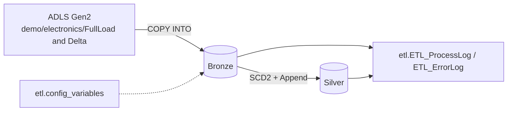

## Microsoft Fabric Data Warehouse — Electronics Medallion ETL (Bronze → Silver)

End-to-end **Medallion Architecture ETL** built on **Microsoft Fabric Data Warehouse**, ingesting Electronics retail CSV files from **Azure Data Lake Storage Gen2** into a **Bronze** raw layer, then applying **SCD Type 2** logic for dimensions and **incremental append** logic for the fact table into a curated **Silver** layer, with **full process and error logging**.

---

### Purpose

- **Ingest** CSV files (`dim_customer`, `dim_product`, `dim_date`, `fact_sales`) from Azure Blob Storage (`demo/electronics/FullLoad/...` and `demo/electronics/Delta/...`) into Fabric DW **Bronze** tables using `COPY INTO`.
- **Curate** Bronze data into **Silver** tables:
  - **Dimensions** → SCD Type 2 with `SHA2_256` HashDiff change detection, `EffectiveStartDate`, `EffectiveEndDate`, and `IsCurrent` flags.
  - **Fact** → append-only incremental load with referential integrity to current dimension rows.
- **Log** every run into `etl.ETL_ProcessLog` and `etl.ETL_ErrorLog` for auditability.
- **Configure** ETL behavior centrally via `etl.config_variables` (storage endpoint, container, file paths, workspace ID, etc.).
- Support **both FullLoad and Delta** ingestion modes through a parameterized stored procedure.

---

## Prerequisites

- A **Microsoft Fabric workspace** with a **Data Warehouse** provisioned.
- **Azure Data Lake Storage Gen2** account holding the `demo` container with the folder layout shown above.
- Permissions to run `CREATE SCHEMA`, `CREATE TABLE`, `CREATE PROCEDURE`, and `COPY INTO`.
- Update `etl.config_variables` with your real values:
  - `az_strg_endpoint` (e.g., `https://<account>.blob.core.windows.net`)
  - `az_strg_container` (e.g., `/demo/`)
  - `workspace_id`, `dw_id`

---

## Execution Sequence

Run the scripts in the numeric order of their filenames. Steps marked **(optional)** are only used for resets or troubleshooting.

| # | Script | Purpose |
|---|--------|---------|
| 0 | `00_cleanup_all_fabric_objects_optional.sql` | **(Optional)** Full environment reset. Drops all ETL procs, logging tables, Silver/Bronze tables, and schemas in correct dependency order. |
| 1 | `01_create_bronze_silver_schemas_and_tables.sql` | Creates `bronze`, `silver`, `etl` schemas and all Bronze + Silver tables (SCD2-ready dimensions and append-only fact). |
| 2 | `02_create_etl_config_variables_table.sql` | Creates `etl.ETL_ProcessLog`, `etl.ETL_ErrorLog`, success/error logging procs, and `etl.config_variables` with default Electronics config values. |
| 3 | `03_create_usp_load_electronics_csv_file_into_bronze_tables.sql` | Creates the parameterized Bronze ingestion proc that resolves the Azure path from config and runs `COPY INTO` for FullLoad or Delta. |
| 4 | `04_load_all_bronze_tables_from_az_strg.sql` | **First baseline load.** Runs `@load_type = 'FullLoad'` for `dim_customer`, `dim_product`, `dim_date`, `fact_sales`. |
| 5 | `05_validating_bronze_tables.sql` | Verifies schemas exist, validates Bronze row counts, and inspects `ETL_ProcessLog` / `ETL_ErrorLog`. |
| 6 | `06_create_usp_load_bronze_into_silver_dim_product.sql` | Creates SCD2 proc for `silver.dim_product`. |
| 7 | `07_create_usp_load_bronze_into_silver_dim_customer.sql` | Creates SCD2 proc for `silver.dim_customer`. |
| 8 | `08_create_usp_load_bronze_into_silver_dim_date.sql` | Creates SCD2 proc for `silver.dim_date`. |
| 9 | `09_create_usp_load_bronze_into_silver_fact_sales.sql` | Creates incremental, append-only proc for `silver.fact_sales`. |
| 10 | `10_load_all_silver_tables_from_fb_dw.sql` | **First Silver load** (`ProcessId = 202`). Runs all four Silver procs in order: product → customer → date → fact. |
| 11 | `11_validating_silver_tables.sql` | Validates Silver row counts and re-checks `ETL_ProcessLog` / `ETL_ErrorLog`. |
| 12 | `12_load_bronze_csv_delta_file_to_test_scd_type_2.sql` | **Delta test driver.** Re-ingests Bronze with `@load_type = 'Delta'` (`ProcessId = 203`) to simulate changed rows for SCD2 testing. |
| 13 | `13_load_all_incremental_bronze_data_into_silver_tables.sql` | **Second Silver load** (`ProcessId = 203`). Promotes Delta Bronze data into Silver via SCD2 and incremental fact insert. |
| 14 | `14_validating_silver_delta_data.sql` | Confirms SCD2 behavior: expired rows (`EffectiveEndDate IS NOT NULL`), new rows, and fact-table change detection by `TransactionID`. |
| 15 | `15_create_etl_usp_get_az_strg_file_endpoint.sql` | Utility proc that builds the dynamic Bronze file paths from `etl.config_variables` and returns the Silver load orchestration list (used by Fabric Pipelines / Lookup + ForEach). |

> **Note on ordering of `15_`:** Although numbered last, this utility proc is typically referenced by a **Fabric Data Pipeline** (Lookup + ForEach) to automate steps 4 and 10/13. Create it any time after step 2 if you plan to orchestrate from Fabric Pipelines.

---

## File-by-File Description

### `00_cleanup_all_fabric_objects_optional.sql` *(optional reset)*
- Drops all ETL stored procedures, logging tables, Silver tables (with PK constraints), Bronze tables, and finally the `silver`, `bronze`, and `etl` schemas.
- Uses `DROP ... IF EXISTS` for **safe, idempotent** execution.

### `01_create_bronze_silver_schemas_and_tables.sql`
- Creates `bronze`, `silver`, `etl` schemas if missing.
- Safely drops/recreates Bronze and Silver tables.
- **Bronze tables** mirror raw CSV layout: `dim_customer`, `dim_product`, `dim_date`, `fact_sales` + `LoadDate`.
- **Silver dimensions** include `SurrogateKey BIGINT IDENTITY`, business keys, and SCD2 scaffolding.
- **Silver `fact_sales`** is append-only (no SCD2) with `LoadDate`.

### `02_create_etl_config_variables_table.sql`
- Creates the **logging tables** `etl.ETL_ProcessLog` and `etl.ETL_ErrorLog`.
- Creates the logging procs `etl.sp_log_process_success` and `etl.sp_log_process_error`.
- Creates `etl.config_variables` and seeds **Electronics** defaults: `az_strg_endpoint`, `az_strg_container`, `az_strg_file_dir` (with `<<load_type>>` and `<<file_category>>` placeholders), per-file CSV names, `workspace_id`, and `dw_id`.

### `03_create_usp_load_electronics_csv_file_into_bronze_tables.sql`
- Creates `etl.usp_load_electronics_csv_file_into_bronze_tables`.
- Parameters: `@TargetTable`, `@FirstRow`, `@ProcessId`, `@load_type` (`FullLoad` or `Delta`), `@AppName`, optional `@Full_File_Path`.
- Resolves the file path dynamically from `etl.config_variables` by replacing `<<load_type>>` and `<<file_category>>` tokens.
- Executes `TRUNCATE TABLE` followed by `COPY INTO` against the resolved Azure Blob path.
- Counts inserted rows and logs success or error.

### `04_load_all_bronze_tables_from_az_strg.sql`
- Baseline **FullLoad** of all four Bronze tables (`ProcessId = 202`).
- Pulls files from `electronics/FullLoad/{dim_customer|dim_product|dim_date|fact_sales}/`.

### `05_validating_bronze_tables.sql`
- Asserts schemas exist (`bronze`, `silver`, `etl`).
- Returns row counts for every Bronze table.
- Returns top 10 entries from `ETL_ProcessLog` and `ETL_ErrorLog` to confirm logging is working.

### `06_create_usp_load_bronze_into_silver_dim_product.sql`
- Creates `etl.usp_load_bronze_into_silver_dim_product`.
- SCD Type 2 logic: detect changes via `SHA2_256` HashDiff, expire old rows (`EffectiveEndDate`, `IsCurrent = 0`), insert new versions, log to ETL tables.

### `07_create_usp_load_bronze_into_silver_dim_customer.sql`
- Creates `etl.usp_load_bronze_into_silver_dim_customer`.
- Same SCD2 pattern as `dim_product`, applied to customer attributes.

### `08_create_usp_load_bronze_into_silver_dim_date.sql`
- Creates `etl.usp_load_bronze_into_silver_dim_date`.
- SCD2 pattern applied to date attributes for full historical traceability.

### `09_create_usp_load_bronze_into_silver_fact_sales.sql`
- Creates `etl.usp_load_bronze_into_silver_fact_sales`.
- **Append-only** fact load. Deduplicates by `TransactionID`, enforces referential integrity by looking up current `Date`, `Customer`, `Product` rows in Silver. Logs success/errors.

### `10_load_all_silver_tables_from_fb_dw.sql`
- Orchestration script: runs the four Silver procs in order (**product → customer → date → fact**) with `ProcessId = 202`.
- Use this **after** the first Bronze FullLoad (step 4).

### `11_validating_silver_tables.sql`
- Asserts schemas exist.
- Returns row counts for all Silver tables.
- Returns latest ETL logs to confirm successful Silver execution.

### `12_load_bronze_csv_delta_file_to_test_scd_type_2.sql`
- Re-runs the Bronze ingestion proc with `@load_type = 'Delta'` (`ProcessId = 203`) for all four tables.
- Pulls files from `electronics/Delta/...` to simulate changed/new rows used to **test SCD2** behavior in the next step.

### `13_load_all_incremental_bronze_data_into_silver_tables.sql`
- Second Silver orchestration run (`ProcessId = 203`).
- Promotes the Delta data: expires changed dim rows, inserts new SCD2 versions, appends new fact rows.

### `14_validating_silver_delta_data.sql`
- For each dimension (`dim_product`, `dim_customer`, `dim_date`): returns **expired rows** (`EffectiveEndDate IS NOT NULL`) and **new/current rows**.
- For `fact_sales`: returns **updated rows** (same `TransactionID`, different attributes) and **new rows** not yet in Silver.

### `15_create_etl_usp_get_az_strg_file_endpoint.sql`
- Creates `etl.usp_get_az_strg_file_endpoint` (`@SchemaName`, `@LoadType`).
- When `@SchemaName = 'bronze'`: returns one row per Electronics CSV file with the **fully resolved Azure Blob path** (endpoint + container + directory with `<<load_type>>` / `<<file_category>>` replaced + filename).
- When `@SchemaName = 'silver'`: returns the ordered list of Silver procs to execute (used by **Fabric Data Pipelines** with **Lookup + ForEach** for full orchestration).

---

## Typical First-Time Run Order

1. (Optional) `00_cleanup_all_fabric_objects_optional.sql`
2. `01_create_bronze_silver_schemas_and_tables.sql`
3. `02_create_etl_config_variables_table.sql` *(then update real endpoint / workspace IDs)*
4. `03_create_usp_load_electronics_csv_file_into_bronze_tables.sql`
5. `15_create_etl_usp_get_az_strg_file_endpoint.sql` *(if orchestrating via Fabric Pipelines)*
6. `04_load_all_bronze_tables_from_az_strg.sql` *(FullLoad)*
7. `05_validating_bronze_tables.sql`
8. `06`–`09` *(create Silver procs)*
9. `10_load_all_silver_tables_from_fb_dw.sql`
10. `11_validating_silver_tables.sql`
11. `12_load_bronze_csv_delta_file_to_test_scd_type_2.sql` *(Delta)*
12. `13_load_all_incremental_bronze_data_into_silver_tables.sql`
13. `14_validating_silver_delta_data.sql`

---

## Logging & Auditing

- **Success log:** `etl.ETL_ProcessLog` — process name, ProcessId, workspace, source/destination, rows inserted, start/end time, duration, status.
- **Error log:** `etl.ETL_ErrorLog` — process name, ProcessId, workspace, source/destination, error message, error time.
- Every Bronze and Silver stored procedure writes to one of these tables on every run.

---

## Notes & Best Practices

- **Bold** convention: all dimension procs share the same SCD2 pattern (HashDiff, expire, insert) for consistency and easier maintenance.
- `@ProcessId` should uniquely identify each ETL run (e.g., `202` for FullLoad baseline, `203` for Delta test).
- Keep secrets (account keys, SAS tokens) **out of source control**. Use Fabric workspace identity or pipeline parameters instead of hardcoding credentials.
- `15_create_etl_usp_get_az_strg_file_endpoint.sql` enables a fully **metadata-driven pipeline** in Fabric — no per-table edits required when adding new tables.

---

## License

<a href="https://techinsightgroup.com/">Tech-Insight-Group LLC</a>

