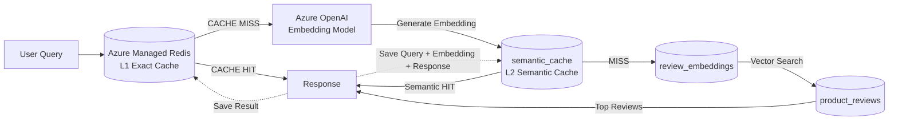

# Building Multi-Layer RAG Caches with PostgreSQL pgvector and Redis

This workshop demonstrates how to build a **Retrieval-Augmented Generation (RAG)** solution on Azure that combines **Redis Exact Caching**, **PostgreSQL Semantic Caching**, and **Vector Similarity Search** to reduce latency, improve scalability, and lower AI inference costs.

The architecture uses a layered approach to query processing, where PostgreSQL serves as the central platform for transactional data, vector storage, semantic caching, and similarity search:

1. **PostgreSQL Backend Storage** stores product reviews, sales data, sentiment analysis results, and application metadata.

2. **PostgreSQL Vector Storage (pgvector)** stores embeddings generated from product reviews and user queries, enabling high-performance vector similarity searches.

3. **L1 Exact Cache (Azure Managed Redis)** serves previously answered questions instantly through exact-match caching, eliminating the need for embedding generation and database queries.

4. **L2 Semantic Cache (PostgreSQL + pgvector)** identifies semantically similar questions using vector similarity and reuses previously generated responses.

5. **Vector Search Engine (PostgreSQL + pgvector)** retrieves the most relevant product reviews when no exact or semantic cache match exists.

6. **Azure OpenAI** generates embeddings that allow the system to understand semantic meaning and power both semantic caching and vector search capabilities.

This design mirrors real-world enterprise AI systems where minimizing repeated embedding generation and vector searches can significantly improve response times and reduce operational costs.

