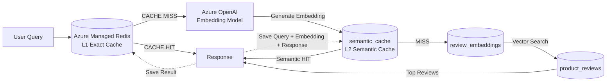

# Building Multi-Layer RAG Caches with PostgreSQL pgvector and Redis

This workshop demonstrates how to build a **Retrieval-Augmented Generation (RAG)** solution on Azure that combines **Redis Exact Caching**, **PostgreSQL Semantic Caching**, and **Vector Similarity Search** to reduce latency, improve scalability, and lower AI inference costs.

The architecture uses a layered approach to query processing, where PostgreSQL serves as the central platform for transactional data, vector storage, semantic caching, and similarity search:

1. **PostgreSQL Backend Storage** stores product reviews, sales data, sentiment analysis results, and application metadata.

2. **PostgreSQL Vector Storage (pgvector)** stores embeddings generated from product reviews and user queries, enabling high-performance vector similarity searches.

3. **L1 Exact Cache (Azure Managed Redis)** serves previously answered questions instantly through exact-match caching, eliminating the need for embedding generation and database queries.

4. **L2 Semantic Cache (PostgreSQL + pgvector)** identifies semantically similar questions using vector similarity and reuses previously generated responses.

5. **Vector Search Engine (PostgreSQL + pgvector)** retrieves the most relevant product reviews when no exact or semantic cache match exists.

6. **Azure OpenAI** generates embeddings that allow the system to understand semantic meaning and power both semantic caching and vector search capabilities.

This design mirrors real-world enterprise AI systems where minimizing repeated embedding generation and vector searches can significantly improve response times and reduce operational costs.




## Script Execution Flow

The workshop is organized into four major components that progressively build the complete multi-layer RAG caching solution.

### 1. Azure Resource Deployment

**Script:** `az_resource_deployment.sh`

This script provisions all Azure resources required for the workshop and prepares the PostgreSQL environment.

#### What it does

- Creates the Resource Group
- Creates Azure OpenAI
- Deploys the embedding model
- Creates Azure AI Language Service
- Creates Azure Database for PostgreSQL Flexible Server
- Enables the `pgvector` and `azure_ai` extensions
- Creates the workshop database
- Generates sample datasets
- Creates database tables
- Loads sample data into PostgreSQL
- Generates embeddings for product reviews
- Performs sentiment analysis
- Creates vector indexes (HNSW)
- Creates Azure Managed Redis
- Generates the `.env` configuration file

#### Additional Testing Section

The bottom portion of the script contains optional testing and validation steps that allow learners to:

- Execute similarity searches
- Test vector retrieval
- Validate sentiment analysis results
- Verify PostgreSQL vector search functionality
- Test Redis caching behavior

---

### 2. Multi-Layer Caching Demonstration

**Script:** `semantic_caching.sh`

This script demonstrates the complete request-processing lifecycle using:

- L1 Exact Cache (Redis)
- L2 Semantic Cache (PostgreSQL + pgvector)
- Product Review Vector Search
- Cache persistence and reuse

#### Request Flow

```text
User Query
      |
      v
L1 Redis Exact Cache
      |
      +--> HIT
      |       |
      |       v
      |   Return Response
      |
      +--> MISS
              |
              v
      Generate Embedding
              |
              v
L2 PostgreSQL Semantic Cache
              |
              +--> HIT
              |       |
              |       v
              |   Return Response
              |
              +--> MISS
                      |
                      v
          Product Review Vector Search
                      |
                      v
          Save Result to Redis
                      |
                      v
      Save Result to Semantic Cache
                      |
                      v
                  Response
```

#### Learning Objectives

- Understand exact-match caching
- Understand semantic caching
- Compare cache-hit and cache-miss scenarios
- Measure performance improvements
- Observe cost-saving opportunities in RAG workloads

---

### 3. Cache Cleanup

**Script:** `semantic_delete_cache.sh`

This utility script removes cached entries and resets the workshop
